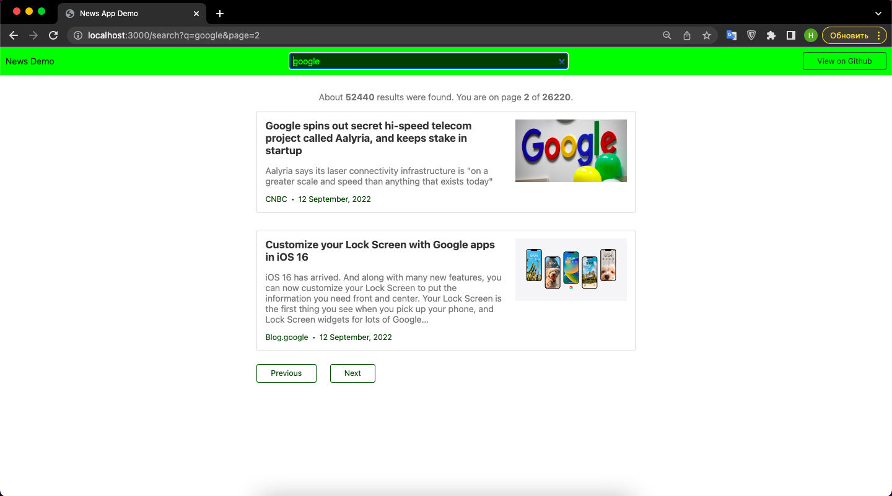

# News-App
## News application built with Go

This application fetches news articles matching a particular search query through the News API and presents the results on a webpage.

As a study project, it covers the basics of using Go’s built-in HTTP server and templating language, and how to interact with external APIs

